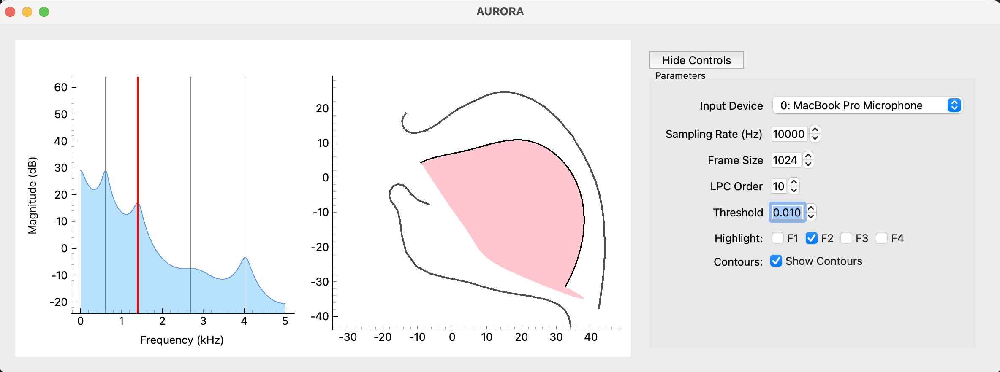

# AURORA

AURORA: Acoustic Understanding and Real-time Observation of Resonant Articulations

## Description

AURORA provides real-time visualization of spectral features with formant tracking and (preliminary) tongue shape estimation. The application captures audio input, performs spectral analysis, and displays spectral peaks and predicted tongue shape in real-time. An example screenshot of the GUI is shown below:




## Requirements

- Python 3.12 or higher
- uv (for dependency management)

## Installation

### 1. Install uv

If you don't have uv installed, follow the installation instructions at [https://docs.astral.sh/uv/getting-started/installation/](https://docs.astral.sh/uv/getting-started/installation/).

### 2. Clone and Setup

```bash
# Navigate to the top-level directory
cd aurora

# Install dependencies
uv sync
```


## Usage

Run the main application:

```bash
uv run python aurora/aurora.py
```


## Configuration

The `config.yaml` file allows you to select between different models, rotate the position of the static vocal tract contours, and set different default acoustic settings. The defaults are:

```
audio:
  fs: 10000                 # sampling rate
  frame_size: 1024          # frame size
  lpc_order: 12             # tune LPC order for speaker-specific formant tracking 
  rms_threshold: 0.03       # only track acoustic input above threshold

data:
  tongue_model: data/tongue_model.pkl   # model for formant-tongue inversion
  template: data/aurora_template.npz    # template for static vocal tract contours

contours:
  rotation_deg: 0.0          # angle to rotate static contours (in degrees)
```

## Author

Sam Kirkham (s.kirkham@lancaster.ac.uk)